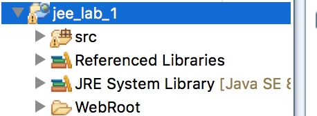

#lab_1 实验题目 开发环境搭建及JDBC访问数据库

> 实验内容：
> 一、实验目的
    1、熟悉开发平台的使用
    2、掌握JDBC访问数据库的方法
> 二、实验内容
    1、搭建平台
    2、通过JDBC访问数据库
    
    
> 三、实验步骤
     参照教材第一章例子
    1、建立数据库
    2、创建java  web工程
    3、配置数据库，建立JDBC连接

实验平台 MyEclipse 2015

##目录结构
实验方式通过导入项目去
了解web项目在MyEclipse是的构建方式



src 存放java文件
这里根据这个项目分析一下src的目录结构

org.db是获取数据库连接
org.dao 简称dao层是对数据库的操作
org.model是数据模型
org.servlet  是处理请求的路由

Referenced Libraries表示该项目引入的一些java库
JRE是运行该java web项目的虚拟机
WebRoot 公开目录存放所有可以被用户的访问的资源, 包括 .html, .jsp, .gif, .jpg, .css, .js, .swf等等
WEB-INF中
  lib是放入项目需要的一些jar包
>   一般的web工程中都会用到web.xml，web.xml主要用来配置，可以方便的开发web工程。web.xml主要用来配置Filter、Listener、Servlet等。但是要说明的是web.xml并不是必须的，一个web工程可以没有web.xml文件。

关于web.xml配置文件的讲解可以到
`http://www.cnblogs.com/hellojava/archive/2012/12/28/2835730.html`

##jdbc连接数据库
jdbc介绍
>引用百度对JDBC的解释：
　　JDBC（Java Data Base Connectivity,java数据库连接）是一种用于执行SQL语句的Java API，可以为多种关系数据库提供统一访问，它由一组用Java语言编写的类和接口组成。JDBC为工具/数据库开发人员提供了一个标准的API，据此可以构建更高级的工具和接口，使数据库开发人员能够用纯 Java API 编写数据库应用程序。
　有了JDBC，向各种关系数据发送SQL语句就是一件很容易的事。换言之，有了JDBC API，就不必为访问Sybase数据库专门写一个程序，为访问Oracle数据库又专门写一个程序，或为访问Informix数据库又编写另一个程序等等，程序员只需用JDBC API写一个程序就够了，它可向相应数据库发送SQL调用。

就我自己感觉而言通过jdbc就不需要关注底层的实现，而是面向实际的应用了。

由于使用习惯就没有使用提供的sql server的驱动而是下载mysql的驱动。

通过获取连接的代码简单说一下

```
public class DBConn{
	public static Connection conn;			
	public static Connection getConn(){
		String url = "jdbc:mysql://localhost/MBOOK";
		   String user = "root";
		   String password = "168496714";
		   try {
			     Class.forName("com.mysql.jdbc.Driver");
			     conn = DriverManager.getConnection(url,user,password);
		   }
		   catch(Exception exception ){exception.printStackTrace();}
		   return conn;
	}
	public static void CloseConn(){
		try{
			conn.close();					
		}catch(Exception e){
			e.printStackTrace();
		}
	}
}

```
由于有不同的驱动,所以对应的url构造方式也不一样,jdbc的构建如下

```
 String url = "jdbc:mysql://localhost/MBOOK";
```
localhosot为主机名
MBOOK为数据库的名字

```
 String user = "root";
 String password = "168496714";
```
user是数据库的用户名
password是数据库的密码

```
  try
  {
  Class.forName("com.mysql.jdbc.Driver");
 conn = DriverManager.getConnection(url,user,password);}
```

这里说明一下，除了使用了maven管理进行导入驱动jar包外，要将jar包方到web-inf的lib目录下
不然会抛出找不到空类的异常。


