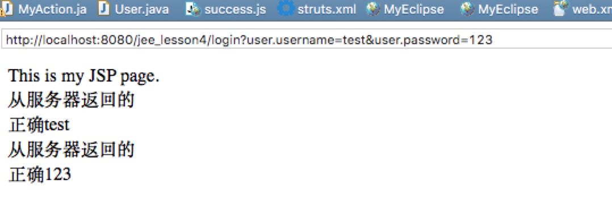

# lesson4
search difference
between **ServletRequestAware** 
to **RequestAware**

**answer:**
> RequestAware and ServletRequestAware both makes your action to deals with the servlet request, but in a difffrent ways,RequestAware gives you the attributes in the servlet request as a map( key as attribute name and value is the object added),But ServletRequestAware gives you the  HttpServletRequest object itslef giving you more flexibility.

简单而言就是
RequestAware类型的servlet request是以map形式的就是以key作为属性名得到对应的value值 
HttpServletRequest类型的servlet request是以对象的形式通过函数访问或者直接访问属性
例子详见demo.
##result configuration
没有添加name等说明的时候代表所有结果都使用该标签处理
##package configuration
###attribute
* name 
* extends
* **==namespace==**(重点注意)
* abstract

name 用于标示区分不同的package
extends（可选）用于表示当前定义的包继承自其他包 (使用该属性时候需要注意父包要在子包前定义)
namespace 用来指定一个命名空间（一个虚拟的路径）。
abstract（可选）定义包为抽象包，则该包不能含有action的配置信息用于被继承
###tags-lists

```
<action>
<default-action-ref>
 配置默认action，找不到对应的action则自动调用
<default-class-ref>
设置默认类
<default-interceptor-ref>:配置默认拦截器
<global-exception-mappings>配置全局的一些异常信息
```
##struts.xml configuration
* include 用于导入其他xml配置文件
* constant 配置一些常量信息在后面会提到
* bean 由容器创建并注入的组件
* package 配置包信息
   
##struts.properties
   框架默认生成这个文件
   通过constant标签进行对默认值进行修改
   详细讲解见
http://www.cnblogs.com/pigtail/archive/2013/02/12/2910348.html

-------
例子在jee_lesson4

内容包括
*package namespace 的演示
*difference between **ServletRequestAware** to **RequestAware*
*action默认使用的是ActionSupport类
**配置文件struts.xml如下**

```
<?xml version="1.0" encoding="UTF-8" ?>
<!DOCTYPE struts PUBLIC "-//Apache Software Foundation//DTD Struts Configuration 2.1//EN" "http://struts.apache.org/dtds/struts-2.1.dtd">
<struts>
 <constant name="struts.devMode" value="true" />
   <package name="lesson4" extends="struts-default">     
      <action name="login" 
            class="com.struts2.action.MyAction">
            <result name="success">/success.jsp</result>
            <result name="error">/error.jsp</result>
      </action>
        <action name="*"  class="com.struts2.action.MyAction">
            <result>/error.jsp</result>
      </action>
   </package>
      <package name="lesson4_2" extends="struts-default" namespace="/test" >     
      <action name="*">
            <result>/error.jsp</result>
      </action>
   </package>
</struts>
```
**MyAction部分代码如下**

```
public class MyAction extends ActionSupport implements RequestAware ,ServletRequestAware {
   private User user;
   private Map myRequestAware;
   private HttpServletRequest myHttpServletRequest;
public User getUser() {
	return user;
}

public void setUser(User user) {
	this.user = user;
}
     public String execute() throws Exception{
    	 if(user.getUsername()!=null||user.getPassword()!=null){
    	 if(user.getUsername().equals("test")&&user.getPassword().equals("123")){
    		 myHttpServletRequest.setAttribute("username", "正确"+user.getUsername());
    		 myRequestAware.put("password","正确"+user.getPassword());
    	 return "success";
    	 } else{
    		 System.out.println("密码错误");
    		 return "error";
    	 }
    	
    	 }
    	 else{
    		 System.out.println("密码错误");
    		 return "error";
    	 }
     }

	@Override
	public void setRequest(Map<String, Object> arg0) {
		myRequestAware = arg0;
		
	}

	@Override
	public void setServletRequest(HttpServletRequest arg0) {
		myHttpServletRequest = arg0;
		
	}
	public String test(){
		 return "hello";
	}
    
}
```
 **User如下**
 
```
public class User {
  private String username;
  private String password;
public String getUsername() {
	return username;
}
public void setUsername(String username) {
	this.username = username;
}
public String getPassword() {
	return password;
}
public void setPassword(String password) {
	this.password = password;
}
  
}

```
 
 
 针对**ServletRequestAware** to **RequestAware**
 这里通过登录后将正确test 、正确123放入通过两种方式得到的request对象
 然后前台通过jsp放入对应的属性名到
 request.getAttribute()得到在服务器放入的值
 下面是跳转到的success.jsp页面部分代码
 
```
 <body>
    This is my JSP page. <br>
    从服务器返回的 ${requestScope.username }<br><%=request.getAttribute("username") %><br>
    从服务器返回的 ${requestScope.password }<br><%=request.getAttribute("") %><br>
  </body>
  
```

**结果**



**namespace的演示**


